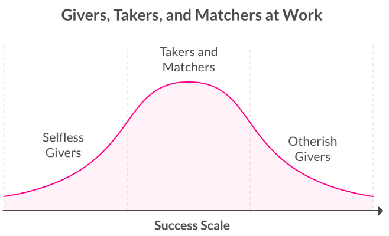
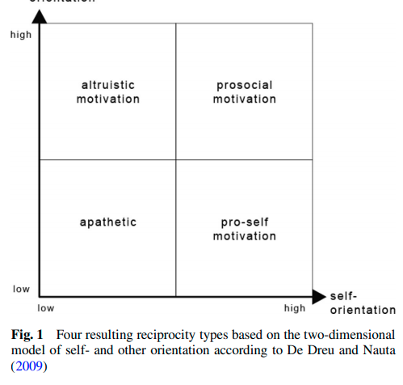
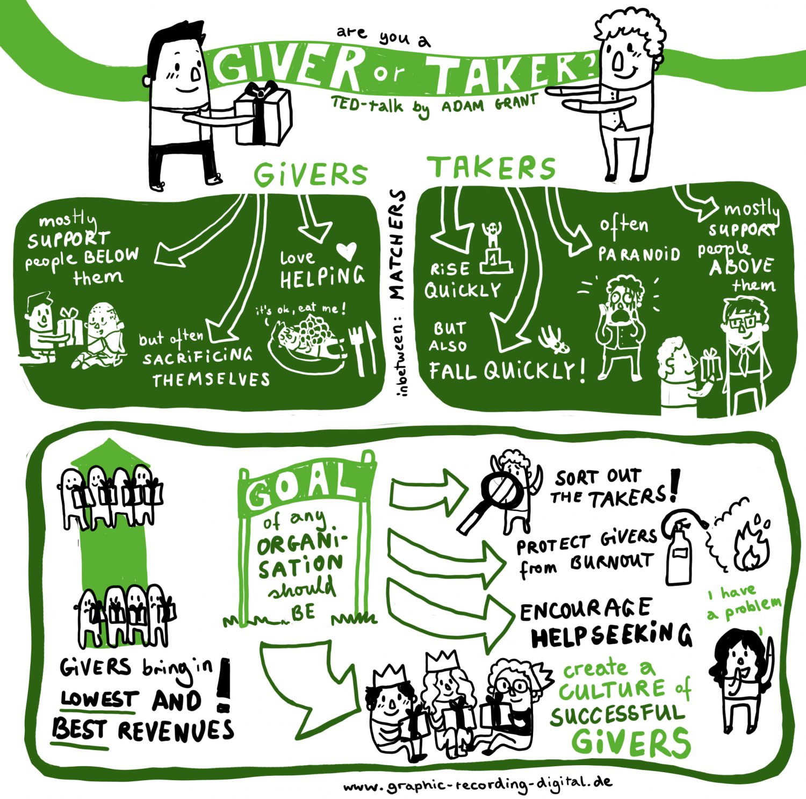

# Notes. Givers, Takers, and Matchers.

### The Surprising Psychology of Givers, Takers, and Matchers

- **Takers** are self-focused and put their own interests ahead of others’ needs. They try to gain as much as possible from their interactions while contributing as little as they can in return.
- **Matchers** like to preserve an equal balance of giving and taking. Their mindset is: “If you take from me, I’ll take from you. If you give to me, I’ll give to you.”
- **Givers** are others-focused, and tend to provide support to others with no strings attached. They ask themselves, “How can I add value for this person? What can I contribute?”

- Humans have an innate tendency to be reciprocal, and givers and takers represent two extremes.

- Turns out, givers tend to be the worst performers. They’re at a disadvantage across a wide range of occupations, because they sacrifice their own success to help others succeed, according to Grant’s research.

  

- Since takers develop reputations for putting others last, matchers tend to return the favor and try to knock them down, research shows. That’s why takers rarely succeed in building strong relationships and networks.

  On the other hand, matchers root for givers to succeed, since they tend to match good deed with good deed. Everyone loves, trusts, and supports givers, since they add value to others and enrich the success of the people around them.

  In short, givers succeed because their giving leads to quality relationships, which benefit them in the long run. With such strong relationships, it’s no wonder givers are also happier people than takers.

  

- There are two types of givers: ‘selfless’ givers and ‘otherish’ givers.

  - **Selfless givers**, as you may guess, are the ones who drop everything to help people all the time, which means they tend to fall behind on their own work. 
  - **otherish givers** are smart and strategic about their giving. While they’re just as much givers as the selfless givers, they’ve learned to successfully navigate a world with matchers and takers, so others don’t take advantage of them.

### Givers, takers and matchers – Reciprocity styles and their contribution to organizational behaviour

- **Takers** try to maximise their own benefit and are thus satisfied if they can take more out of a situation than they invest. They will often interpret situations as a win-lose dilemma. Because they are cautious and try to protect themselves, they have a general mistrust of other people and base their actions on the principle of rational self-interest. They will offer collegial support only for impression management – if their contribution is clearly visible, boosts their reputation or promises other profits in return.

- **Givers** support others and focus their efforts on achieving positive outcomes for others; givers interpret interaction with others as potential win-win situations.

  - self-sacrificing givers act in a genuinely altruistic manner, often at their own expense when they are unable to reject a collegue’s request for help.
  - successful givers tend to invest their time and effort economically. Successful givers provide collegial support when the benefit to others is greater than the personal cost and when their effort leads to a positive impact for the team, the department and the organization.

- Between the takers and the givers are the so-called **matchers**, who strive for balance or reciprocity. When engaging in an interaction with others, matchers evaluate whether their effort is likely to be reciprocated or not. When engaging in new relationships, they hesitate to invest effort and time unless they get a clear indication that they will get something in return. Matchers have a relatively strict understanding of reciprocity. They try to preserve an equal balance of giving and receiving, which results in a titfor-tat strategy: if they support somebody, they expect to be supported in the future. 

  

- givers have the potential to be more successful than takers and matchers not despite but because of the fact that they are concerned with the interests of others.

- The analysis of reciprocity styles has to be considered as prosocial behaviour in the organizational context. Whereas prosocial behaviour comprises acts that benefit others (Penner et al. 1995), Prosocial Organizational Behaviour (POB) is specifically performed by an employee, is directed toward an individual, group or organization, and is performed with the intention of promoting the welfare of those towards whom it is directed (Brief and Motowidlo 1986).

- So although sometimes used synonymously, altruism should be considered as a differentiated form of prosocial behaviour (Bierhoff 2010). Although evolutionary theories such as kin selection (Hamilton 1964) and reciprocal altruism (Trivers 1971) deliver explanations for altruistic behaviour towards genetically-related individuals, they fail to explain altruistic behaviour in the workplace which is mostly directed towards genetically-unrelated individuals. Selfless giving without maintaining a healthy focus on one’s own needs is even sometimes associated with personality disorders (Furnham et al. 2014).

  Four resulting reciprocity types based on the two-dimensional model of self- and other orientation according to De Dreu and Nauta (2009)

  

- 

### Giver, taker o matcher: Altruismo, egoísmo o compañerismo

Source: https://blog.agirregabiria.net/2019/09/giver-taker-o-matcher-altruismo-egoismo.html

- Siguiendo a **[Grant](https://en.wikipedia.org/wiki/Adam_Grant)** resulta que se abre el siguiente reto para el liderezgo de cualquier organización: *¿cómo convertir la paranoia propia de los “takers”, complementada por el “cotilleo” que caracteriza a los “matchers” en la “pronoia” que necesitan los “*[***givers\***](https://tu-mapa.es/donantes-que-aportan-a-las-organizaciones/)*”, y que no es otra cosa que la creencia de que hay más gente que conspira a favor de tu bienestar que en contra?*

### The network always wins: scientific proof that your PR strategy should focus more on giving and less on taking

- People really like generous, selfless people, and having a lot of people really like you and want to help you is a huge career advantage. One study, conducted among Belgian medical students, showed that givers lagged the first year of their studies as they utilized scare energy and hours helping others.

- Is it possible that, as a giver, you’ll expend effort on someone and not see that effort paid back? Of course. Your generosity might even be actively taken advantage of now and again. But the cost of these occasional disappointments is dwarfed by the benefits of giving people the benefit of the doubt. It’s a stance called “pronoia”.

  *“According to the distinguished psychologist Brian Little, pronoia is ‘the delusional belief that other people are plotting your well-being, or saying nice things about you behind your back,’*” explains Grant.

### What Can You Say About Your Team? Giver, Taker Or Matcher?

- Here are three characteristics to help you figure out if your colleagues are takers.

  - Asks for support and advice without any boundaries
  - Selfish behaviour, they’re only focused on earning that bonus raise and might get an unfair, offensive conduct
  - They often make remarks about individual achievements and show off with their results

- Matcher team behaviour is represented by:
  - Providing help to those who help them, thus having some sort of previous relationship with the respective person
  - Share knowledge only when a colleague requests it, there is no initiative to offer their expertise and support
  - Seeking reciprocity and keep the score for their behaviour

- You may recognize your giver colleagues by spotting these three ways of behaving at work.
  - They sharing information and indications without seeking anything in return.
  - Generous givers succeed to lift their colleagues up.
  - Your giver teammates always offer to do the hard work.