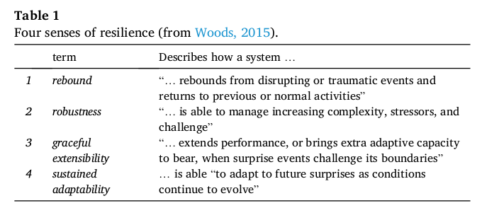
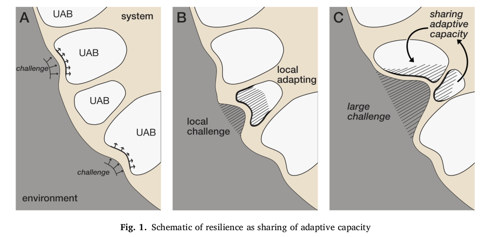

## Building and revising adaptive capacity sharing for technical incident response: A case of resilience engineering.

Richard I. Cook, Beth Adele Long, "Building and revising adaptive capacity sharing for technical incident response: A case of resilience engineering"

#### NOTES

- The deliberate, iterative, empirically grounded production of a system with desired properties we take to be engineering and, because the goal of the activity was to share the organization’s adaptive capacity, we regard this case as an example of resilience engineering. We rely on Woods’ theory of
  graceful extensibility along with the notion of sustained adaptive capacity for resilience itself.
- Because challenge events may occur without warning and at any time, high availability entails continuous surveillance for new events and fast response when an anomaly appears. Although many anomalies that require attention are mundane, a new event may represent an entirely new phenomenon or a novel combination of phenomena.
- The frequent but irregular drumbeat of operational incidents stresses the organization’s capacity to adapt.
- 

- Within the company, normal work is done by small teams. Teams maintain an on-call rotation and are responsible for handling events that affect their assigned components. While this approach produces efficient response to many anomalies the event salvo contained events that were difficult to troubleshoot. In response, a group established a support cadre to assist in response to high severity or difficult to resolve events. This group would provide a deep technical resource that could be called on to support incident response.

- ‘Ordinary’ events can be handled by the regular responders but the response to larger events benefits from additional expertise. To respond effectively and efficiently to the variable, unpredictable challenge pattern requires the capacity to adapt.

- The example suggests that sharing adaptive capacity depends on specific characteristics of the environment. Among these are the tempo, duration and magnitude of challenges from the environment.

  - Tempo. There is probably a narrow range of incident tempo that makes this sort of support approach viable.
  - Duration. Incidents need to last long enough for the sharing process to take effect but not so long that the sharing leads to damage for the donor team. Incidents in this environment are typically minutes to hours long
  - Magnitude. The variability of incident intensity makes sharing expertise useful.

- Mobilizing and applying the adaptive capacity in this example de­ pends on the nature of local expertise and the ability to bring that expertise to bear without significant delay. Sharing expertise is possible because relevant expertise is distributed across the work teams.

- The example suggests that familiarity with local conditions will make sharing efficient. Sharing is efficacious because the individuals are in more or less constant contact with the problem space, are up to date with the state of the system, and are well suited to engagements with the other people working on the problem. It is likely that smooth sharing of adaptive capacity will be more difficult for people who lack local knowledge and possess only general expertise.

- Woods’ theory of graceful extensibility predicts that resilience will appear as individual “units of adaptive behavior” exhaust their own adaptive capacity and obtain additional capacity from other units in their network. Resilience is not fortitude but the moment-by-moment sharing of adaptive capacity within a network of units of adaptive behavior.

  

- The unit here is a team of people that, from time to time, is required to cope with an incident. When an incident threatens to exhaust that group’s capacity it can obtain support from those in surrounding units.
- Graceful extension of the group’s capacity to respond is an expression of resilience (Eksted and Cook, 2015). What makes the example a case of resilience engineering is the deliberate, iterative, and empirically based creation and modification of a method to make that makes the expres­sion of resilience – the sharing of adaptive capacity (Woods, 2018) – efficient, effective, and – most of all – sustainable.
- We hypothesize that this approach is successful because of the domain of practice and the stream of incidents make resilience engi­neering productive. In particular, the incident characteristics, tempo and variability make ad hoc sharing useful. If the incidents were monotonous with a fixed frequency and constant severity there would few challenges to the adaptive capacity of the response unit and no need
  for acquiring adaptive capacity from a neighboring unit. If all the units possessing useful expertise were engaged in uninterruptible tasks, no sharing would be possible. If the incidents themselves required long term commitments of resources sharing would damage the capacity of the contributing unit.

- In contrast, situations with dissimilar conditions may prove resistant.

